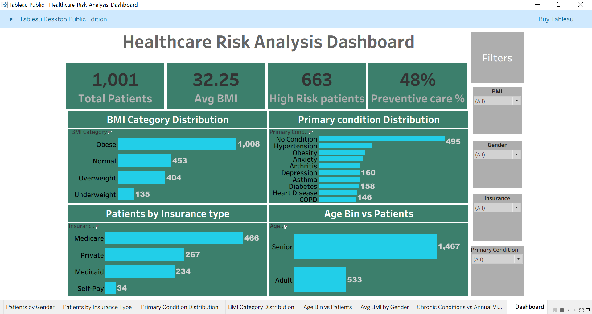

# Healthcare Risk Analysis Dashboard (Tableau)
## Objective

This project analyzes healthcare patient data to identify risk patterns based on BMI, Age, Gender, and Insurance Type.

## Tools Used
- Tableau
- Data Visualization
- Healthcare Dataset

## Key Insights
- Obese BMI category shows higher patient risk levels.
- Certain insurance types have higher patient counts.
- Age distribution helps identify high-risk groups.

## Dashboard Preview

## Interactive Dashboard
View the full interactive dashboard on Tableau Public:

https://public.tableau.com/app/profile/mohammad.sohail1387/viz/Book1_17728996151140/Dashboard
