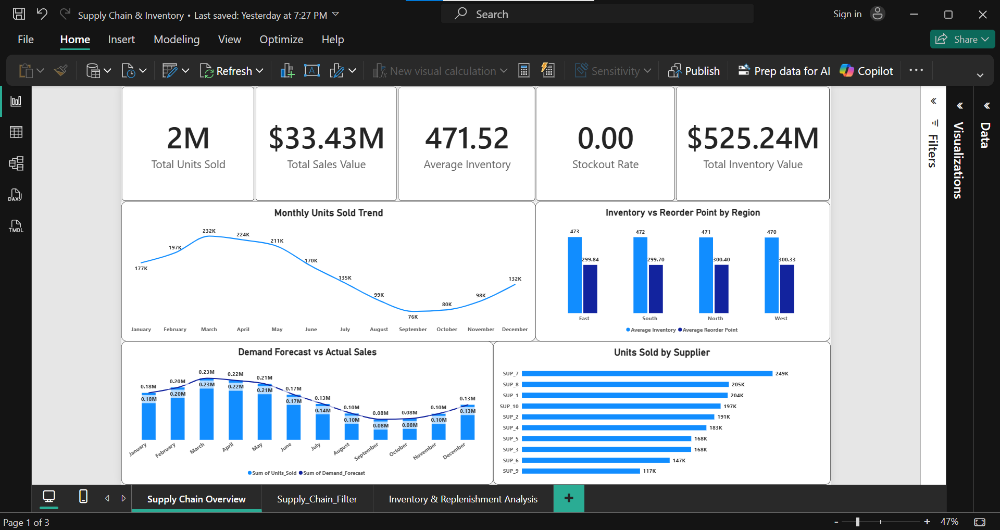
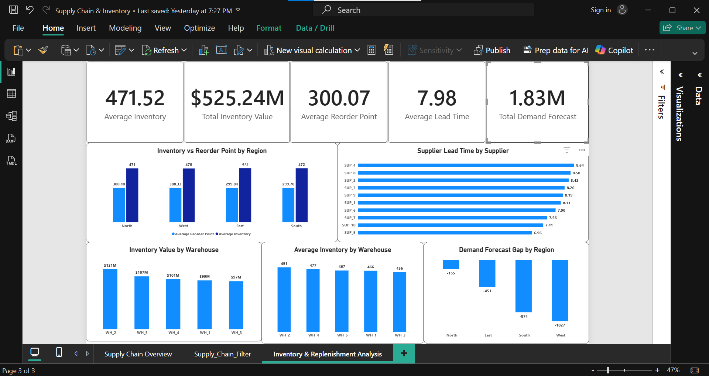
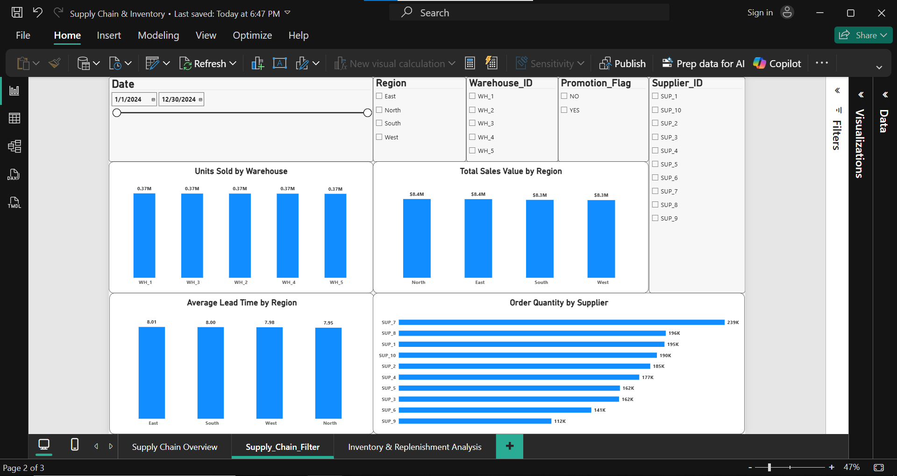

# Supply Chain & Inventory Analytics Dashboard

A Power BI dashboard designed to analyze supply chain performance, inventory levels, supplier lead times, warehouse performance, sales, and demand forecasting.

## 🛠️ Tools Used

- Power BI
- Power Query
- DAX
- CSV Dataset

## 📊 Key KPIs

- Total Units Sold: 2M
- Total Sales Value: $33.43M
- Average Inventory: 471.52
- Stockout Rate: 0.00%
- Total Inventory Value: $525.24M
- Total Demand Forecast: 1.83M

## 📈 Dashboard Pages

### 1. Supply Chain Overview
Provides an overview of sales, inventory, demand forecasting, regional performance, and supplier performance.

### 2. Inventory & Replenishment Analysis
Analyzes inventory levels, reorder points, inventory value, supplier lead time, warehouse performance, and demand forecast gaps.

### 3. Warehouse & Sales Analysis
Provides warehouse-level sales analysis along with regional sales, lead time, and supplier order quantity analysis.

## 💡 Key Insights

- Actual sales are below the overall demand forecast, indicating a forecast-to-sales gap.
- Inventory value is significantly higher than sales value, highlighting the importance of monitoring inventory efficiency.
- Average supplier lead time is approximately 8 days.
- Stockout rate is 0% in the available dataset.
- Regional and warehouse-level analysis helps identify differences in inventory and sales performance.

## 📂 Dataset

High-Dimensional Supply Chain Inventory Dataset from Kaggle.

## 🎯 Project Objective

The objective of this project is to demonstrate practical skills in Power BI dashboard development, Power Query data preparation, DAX calculations, KPI analysis, and business-focused data visualization.
